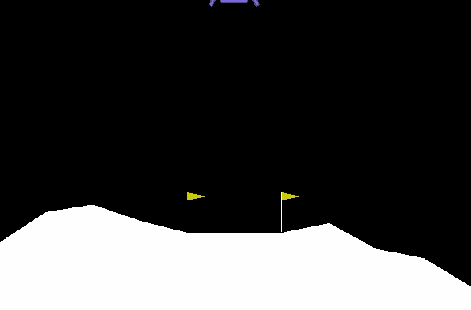
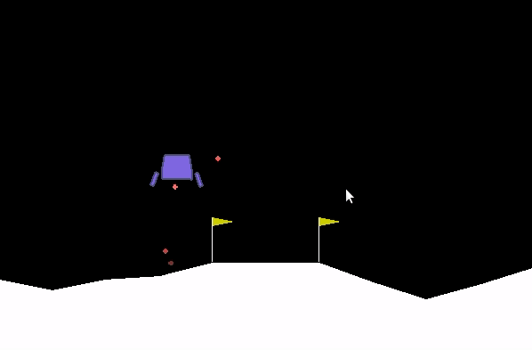

# DQN Algorithm: Exercise and research chain

Here we present our results for the DQN algorithm as well as the research chain followed in order to increase our understanding of the parameters in the training section.
This is separated in several parts:
* <a href='.'>Vanilla DQN</a><br>
* <a href='double_DQN'>Double DQN</a><br>
* <a href='double_DQN/prio_replay_sumtree/'>Double DQN with Prioritized Memory Replay</a><br>

## DQN algorithm

The vanilla version of the DQN algorithm was implemented in this same section. The model used for the Q network was:

```
self.fcl1 = nn.Linear(8, 64)
self.fcl2 = nn.Linear(64, 128)
self.fcl3 = nn.Linear(128, 4)

x = F.relu(self.fcl1(state))
x = F.relu(self.fcl2(x))
x = (self.fcl3(x))
```

## Animated Results
### Dumb Agent
<p align="center">
  
</p>

### Trained Agent


