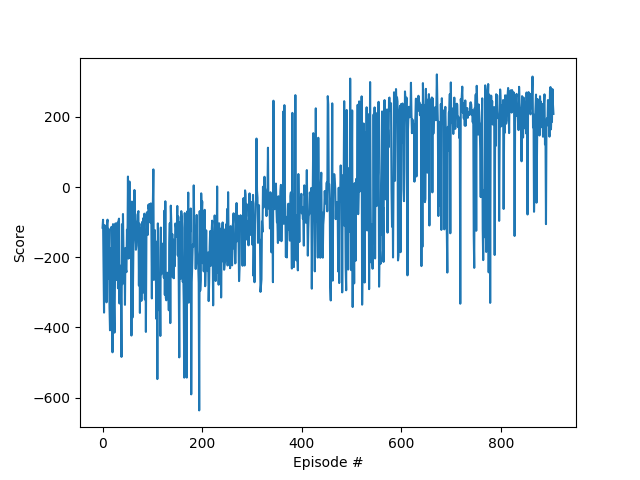
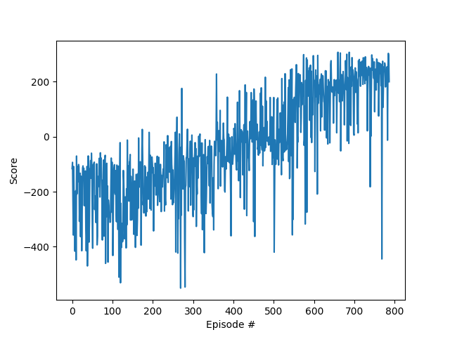
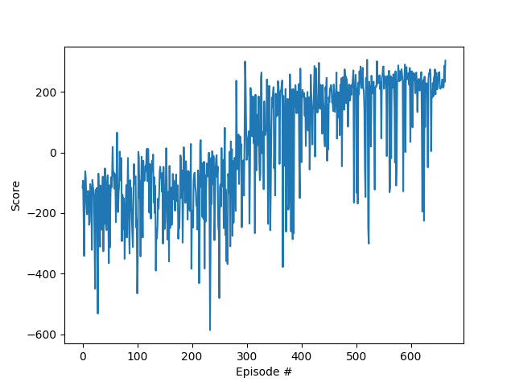

## Prioritized memory replay implemented with a Sum Tree

In this section a sum tree was implemented and used for the prioritized sampling with importance weights. These weights are mainly used for stabilizing the training process, which results more helpful at the early stage of training.

### Training parameters

- Episodes number: 2000
- Max. time steps per episode: 1000
- Initial epsilon: 1
- Final epsilon: 0.01
- Epsilon decay: 0.995

#### Memory:
- Buffer size: 1e5
- Batch size: 32
- Replay alpha: 0.6
- Replay beta: 0.5 annealed into 0.01 with a summed increment of 0.000003 per episode.

#### Optimization:
- Optimizer: RMSprop
- LR: 3E-5 (learning rate)
- Momentum: 0.95
- Notice: Learning rate was changed to 2E-5 at episode 550 to allow for further adapted learning.

#### Further parameters:
- Gamma: 0.995 (discount factor)
- Tau: 1E-3 (soft update of target)
- Update every: 4 time steps

### Experiments

In order to arrive to the selected parameters, which allow for solution of the interaction in 564 episodes, several tests were performed with the parameters of the replay memory in coordination with those of Double DQN and the optimizer. The next graphs recapitulate the training dynamics at specific important changes during training.

#### Experiments
- Batch size was decreased from 64 to 32, improving generalization.

- Increased replay beta from 0.4 to 0.5. Which allowed for stronger importance weighting. With the commented annealing this resulted to work out pretty well.

- We noticed that increasing beta had a positive effect on the training which only can be used while it is being totally annealed. For this we decided to decrease epsilon decrease rate and to induce a step in the learning rate at some detected episode to avoid coming out from the descending path due to inertia. This decision resulted in a decrease of 100 episodes of solving time.

