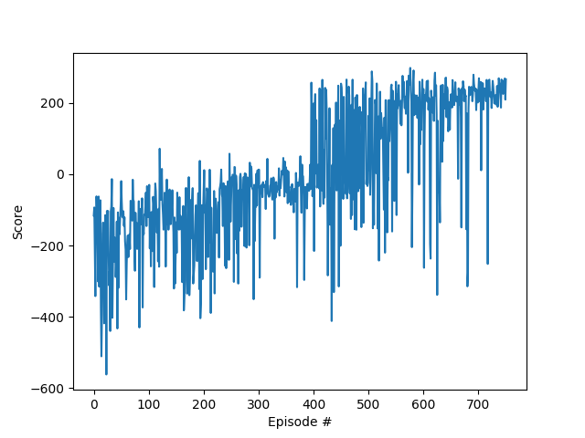
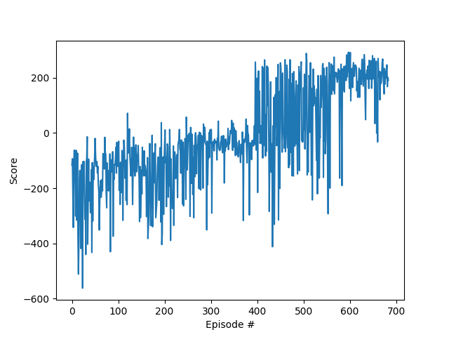
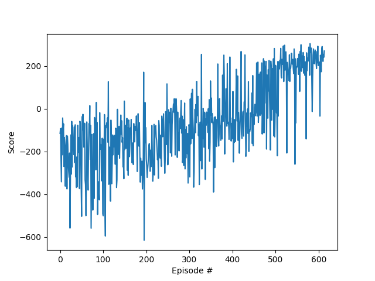

## Dueling DQN networks

We implemented the DQN algorithm respective to the Dueling DQN architecture. For this a new neural network is proposed namely>

```
self.fcl1 = nn.Linear(state_size, hidden_size)
self.fcl2 = nn.Linear(hidden_size, 2*hidden_size)
self.fcl3 = nn.Linear(2*hidden_size, 1)
self.fcl4 = nn.Linear(hidden_size, 2*hidden_size)
self.fcl5 = nn.Linear(2*hidden_size, action_size)

# State value stream
x1 = F.relu(self.fcl2(x))
x1 = self.fcl3(x1)

# Action advantage stream
x2 = F.relu(self.fcl4(x))
x2 = self.fcl5(x2)

# Break intractability
A = x2 - (torch.mean(x2) * torch.ones(self.action_size))
V = x1 * torch.ones(self.action_size)
```

### Experiments

In order to arrive to the selected parameters, which allow for solution of the interaction in 584 episodes, several tests were performed. The next graphs recapitulate the training dynamics at specific important changes during training.

#### Experiments
- Increased learning rate to 6E-5 and allowed a step at episode 600 to 4E-5



- Further increased the step by allowing it to jump to 2E-5 at episode 550.



- Changed dueling architecture


