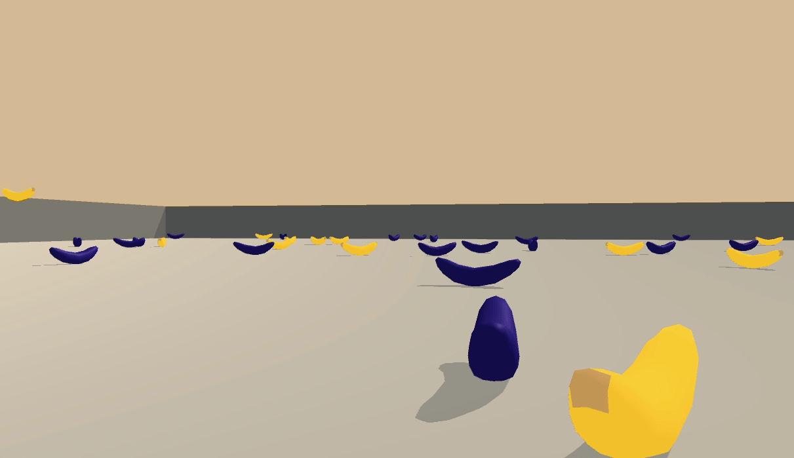
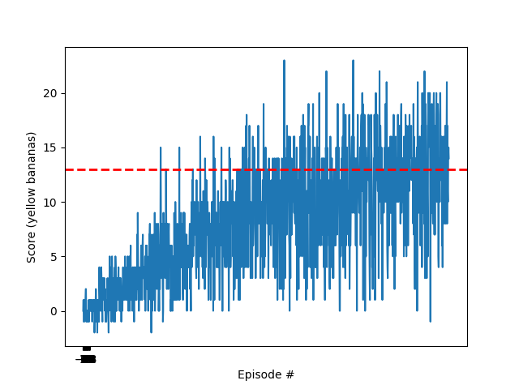

# Project 1: Ray based applied Navigation

In this small report we present the methods used to get the task solved. In particular the learning algorithm will be described and the results will be presented. In the end, an outlook is mentioned in order to tackle possible improvement possibilities.

## Learning algorithm

In a very concise manner we used **Double Dueling DQN with prioritized memory recall**. We believe this was a good choice given that it allows for separating the importance of the actions from that of the states. This for sure allows the found policy to concentrate on acting when necessary and at the same time, with the basic Q learning framework to delay rewards in order to move when possible to maximize reward. Furthermore, the fact that new bananas are appearing randomly all of the time supports the hypothesis that a good agent performs better by concentrating on looking at the ray-described state and picking an action then based on its "convenience" rather to having to memorize the combinations.

As said before, a reward of +1 is provided for collecting a yellow banana, and a reward of -1 is provided for collecting a blue banana, this does not enforce the agent to collect them as quick as possible but to avoid blue bananas. This is why we decided to call this project as applied navigation, given that this scenario could very well be used for trajectory planning problems or obstacle avoidance (i.e. imagine we make bananas bigger).

### Architecture

The dual dueling networks (local and target) have the same structure, described in torch format as:

```
self.fcl1 = nn.Linear(state_size, hidden_size)
self.fcl2 = nn.Linear(hidden_size, 2*hidden_size)
self.fcl3 = nn.Linear(2*hidden_size, 1)
self.fcl4 = nn.Linear(hidden_size, 2*hidden_size)
self.fcl5 = nn.Linear(2*hidden_size, action_size)

# State value stream
x1 = F.relu(self.fcl2(x))
x1 = self.fcl3(x1)

# Action advantage stream
x2 = F.relu(self.fcl4(x))
x2 = self.fcl5(x2)

# Break intractability
A = x2 - (torch.mean(x2) * torch.ones(self.action_size))
V = x1 * torch.ones(self.action_size)
```

Notice that for training a variable hidden size was proposed. By computing the scalar state values V and the action convenience matrix A a means of breaking the intractability between both was needed, here the mean of the outputs of the neural stream determining the A matrix was substracted.

In this section a sum tree was implemented and used for the prioritized sampling with importance weights. These weights are mainly used for stabilizing the training process, which results more helpful at the early stages of training but more important at the latest, when the algorithm is about to converge (given that a bigger beta parameter implies smaller learning rate).

#### Training parameters

- Max. time steps per episode: 1000
- Initial epsilon: 1
- Final epsilon: 0.01
- Epsilon decay: 0.995

#### Memory:
- Buffer size: 1e5
- Batch size: 32
- Replay alpha: 0.6 (and kept it constant)
- Replay beta: 0.5 annealed into 0.01 with a summed increment of 0.000003 per episode.

#### Optimization:
- Optimizer: RMSprop
- LR: 6E-5 (learning rate) and stepped down into 2E-5 at episode 1100
- Momentum: 0.95

#### Further parameters:
- Gamma: 0.995 (discount factor)
- Tau: 1E-3 (soft update of target)
- Update target network with local every: 4 time steps


##  Results



We could solve the interaction in 1194 episodes. For completeness we leave here the learning dynamics. Notice that we adjusted the learning rate at episode 1200 as explained.

```
Episode 100	Average Score: 0.67	epsilon: 0.61	beta: 0.52
Episode 200	Average Score: 2.13	epsilon: 0.37	beta: 0.54
Episode 300	Average Score: 4.34	epsilon: 0.22	beta: 0.57
Episode 400	Average Score: 5.25	epsilon: 0.13	beta: 0.59
Episode 500	Average Score: 7.08	epsilon: 0.08	beta: 0.61
Episode 600	Average Score: 7.86	epsilon: 0.05	beta: 0.63
Episode 700	Average Score: 9.53	epsilon: 0.03	beta: 0.66
Episode 800	Average Score: 9.89	epsilon: 0.02	beta: 0.68
Episode 900	Average Score: 9.58	epsilon: 0.01	beta: 0.700
Episode 1000	Average Score: 11.00	epsilon: 0.01	beta: 0.72
Episode 1100	Average Score: 11.47	epsilon: 0.01	beta: 0.75
Episode 1200	Average Score: 12.10	epsilon: 0.01	beta: 0.77
Episode 1200	Average Score: 12.10	epsilon: 0.01	beta: 0.77 adjusting learning rate!
**Episode 1294	Average Score: 13.00	epsilon: 0.01	beta: 0.79**
```

The corresponding learning graph can be visualized here:



## Outlook
As you can see above, the learning dynamics was quite smooth until reaching an average value of 9. From then on we just tried to get as close as possible with RMSPRop to the desired value of 13 and reduced the learning rate to allow for certain convergence. This does not mean that the algorithm stops learning, in fact we performed a complementary experiment that demonstrates that the value can keep on increasing and whose learning dynamics is pasted here:

```
Episode 100	Average Score: 0.67	epsilon: 0.61	beta: 0.52
Episode 200	Average Score: 2.13	epsilon: 0.37	beta: 0.54
Episode 300	Average Score: 4.34	epsilon: 0.22	beta: 0.57
Episode 400	Average Score: 5.25	epsilon: 0.13	beta: 0.59
Episode 500	Average Score: 7.08	epsilon: 0.08	beta: 0.61
Episode 600	Average Score: 7.86	epsilon: 0.05	beta: 0.63
Episode 700	Average Score: 9.53	epsilon: 0.03	beta: 0.66
Episode 800	Average Score: 9.89	epsilon: 0.02	beta: 0.68
Episode 900	Average Score: 9.58	epsilon: 0.01	beta: 0.70
Episode 1000	Average Score: 11.00	epsilon: 0.01	beta: 0.72
Episode 1100	Average Score: 11.47	epsilon: 0.01	beta: 0.75
Episode 1200	Average Score: 12.10	epsilon: 0.01	beta: 0.77
Episode 1200	Average Score: 12.10	epsilon: 0.01	beta: 0.77 adjusting learning rate!
Episode 1300	Average Score: 13.09	epsilon: 0.01	beta: 0.79
Episode 1400	Average Score: 12.43	epsilon: 0.01	beta: 0.81
Episode 1500	Average Score: 12.69	epsilon: 0.01	beta: 0.84
**Episode 1600	Average Score: 13.46	epsilon: 0.01	beta: 0.86**
**Episode 1700	Average Score: 13.42	epsilon: 0.01	beta: 0.88**
Episode 1775	Average Score: 12.95	epsilon: 0.01	beta: 0.90
```

As a very obvious improvement we could keep decreasing the learning rate in a quicker manner after some point.

As you can see in the video above, the policy above works just fine, noticing the existence of blue bananas and avoiding them or picking them if being yellow. The drawback here is having to look in the direction of a banana to perform an action (reason for which we selected dueling networks). We can for sure increase the field of view of the agent by implementing a CNN covering a 2D view of the environment.
