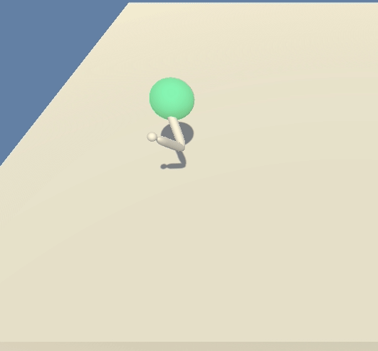

# Project 2: Continuous Control

In this small report we present the methods used to get the task solved. In particular the learning algorithm will be described and the results will be presented. In the end, an outlook is mentioned in order to tackle possible improvement possibilities.

## Learning algorithm

In a very concise manner we used **Deep Deterministic Policy Gradients (DDPG)**. We believe this was a good choice given that it allows for separating the importance of the actions from that of the states. This for sure allows the found policy to concentrate on acting when necessary and at the same time, with the basic Q learning framework to delay rewards in order to move when possible to maximize reward. Building on the Double Q Network approach, two of each actor and critic were spawned into what is called a local network and a target network for each. Some special enhancements to the algorithm were using Batch Normalization after the first activation for both actor and critic and gradient normalization before training the critic at EACH step (i.e. we did not follow the recommendation to update x times every y timesteps).

As said before, a reward of +0.1 is provided for tracking the setpoint at a specific time step. This enforces only to keep tracking it as soon as it is reached for the first time (given that the initial state is stochastic and the robot does not start touching the set point necessarily).

### Architecture

By considering a tupple of hidden layer sizes hidden_sizes = (128, 128)

The actor has the next architecture:

```
self.fcl1 = nn.Linear(state_size, hidden_sizes[0])
self.fcl2 = nn.Linear(hidden_sizes[0], hidden_sizes[1])
self.fcl3 = nn.Linear(hidden_sizes[1], action_size)
self.bn1 = nn.BatchNorm1d(hidden_sizes[0])

x = F.relu(self.fcl1(state))
x = self.bn1(x)
x = F.relu(self.fcl2(x))
actions = F.tanh(self.fcl3(x))
```
The critic, on the other side:

```
self.fcl1 = nn.Linear(state_size, hidden_sizes[0])
self.fcl2 = nn.Linear(hidden_sizes[0] + action_size, hidden_sizes[1])
self.fcl3 = nn.Linear(hidden_sizes[1], 1)
self.bn1 = nn.BatchNorm1d(hidden_sizes[0])

x = F.relu(self.fcl1(state))
x = self.bn1(x) 
x = F.relu(self.fcl2(torch.cat([x, action], dim=1)))
Value = self.fcl3(x)

```
A normal random memory replay is included.

#### Training parameters

- Max. time steps per episode: 1000

#### Memory:
- Buffer size: 1e5
- Batch size: 128

#### Optimization:
- Optimizer: Adam
- LR actor: 2E-4
- LR critic 2E-4

#### Further parameters:
- Gamma: 0.99 (discount factor)
- Tau: 1E-3 (soft update of target)
- Update target network with local every: 1 time steps
- Exploration through Ornstein-Uhlenbeck process with parameters:
    - mu = 0
    - theta = 0.15
    - sigma = 0.1


##  Results



We could solve the interaction in 91-191 episodes (mean of 100 episodes(. For completeness we leave here the learning dynamics. 

```
Episode 100	Average Score: 4.40	last score: 10.42
Episode 191	Average Score: 30.04	last score: 36.87
Environment solved in 91 episodes!	Average Score: 30.04
```

The corresponding learning graph can be visualized in the Jupyter Notebook.


## Outlook
As you can see above, the learning dynamics was quite smooth until reaching an average value of 30. IN offline experiments we allowed for further training and we could reach an approximate value of 40!

As a very obvious improvement we could keep decreasing the learning rate in a quicker manner after some point and for sure very important here to include a prioritized replay, as only few experiences at the beginning have to be replayed with many more useless ones given that the robot cannot locate the set point when it does not start close to it.

As you can see in the video above, the policy above works just fine. Other algorithms should perform just fine as well (i.e. PPO) and would be worth giving them a try. 
