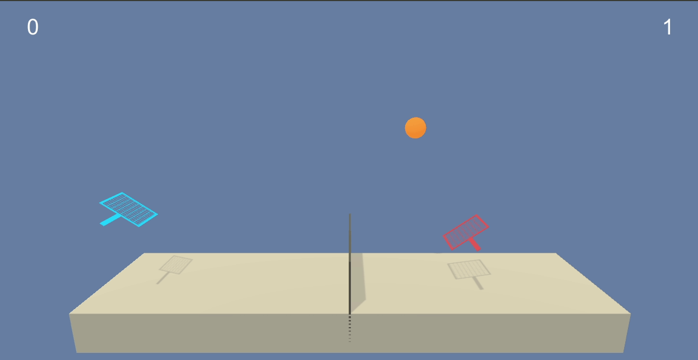

# Project 3: Collaboration and Competition

In this small report we present the methods used to get the task solved. In particular the learning algorithm will be described and the results will be presented. In the end, an outlook is mentioned in order to tackle possible improvement possibilities.

## Learning algorithm

In a very concise manner we used **Multi Agent Deep Deterministic Policy Gradients (MADDPG)**. We believe this was a good choice given that it allows for separating the importance of the actions from that of the states per agent. This for sure allows the found policy to concentrate on acting when necessary and at the same time, with the basic Q learning framework to delay rewards in order to move when possible to maximize reward. Building on the Double Q Network approach, two of each actor and critic were spawned into what is called a local network and a target network for each agent. Some special enhancements to the algorithm were using Batch Normalization after the first activation for both actor and critic and gradient normalization before training the critic at EACH training step. We also allowed for continuous updates every certain number of iterations.

Our framework uses one separate neural network for the actor and one for the critic for each agent. The difference in sampling per iteration incurs into different behavior per agent, allowing a more efficient exploration of the state space and the generation of learning codependencies. As it will be seen, even though popular with the algorithm, no gradient clipping was used.

As said before, a reward of +0.1 is provided for every time the ball is "correctly" served to the other side, i.e. not before the net and not after the opposite maximum allowed play area, -0.01 if not. No further constraint was imposed on the agents, such that a collaboration approach is enforced. Notice that even though both agents compete with each other, the aim of the task is to keep the ball in the air as long as possible.

### Architecture

By considering a tupple of hidden layer sizes hidden_sizes = (400, 300) for each the actor and the critic:

The actor has the next architecture:

```
self.seed = torch.manual_seed(seed)
self.fcl1 = nn.Linear(state_size, hidden_sizes[0])
self.fcl2 = nn.Linear(hidden_sizes[0], hidden_sizes[1])
self.fcl3 = nn.Linear(hidden_sizes[1], action_size)
self.bn1 = nn.BatchNorm1d(hidden_sizes[0])

x = F.relu(self.fcl1(state))
x = self.bn1(x)
x = F.relu(self.fcl2(x))
actions = F.tanh(self.fcl3(x))
```
The critic, on the other side:

```
self.fcl1 = nn.Linear(state_size + action_size, hidden_sizes[0])
self.fcl2 = nn.Linear(hidden_sizes[0], hidden_sizes[1])
self.fcl3 = nn.Linear(hidden_sizes[1], 1)
self.bn1 = nn.BatchNorm1d(hidden_sizes[0])

x = torch.cat((state, action.float()), dim=1)
x = F.relu(self.fcl1(x))
x = self.bn1(x) 
x = F.relu(self.fcl2(x))
values = self.fcl3(x)

```
A normal random memory replay is included. Notice that batch normalization is included AFTER the first nonlinearity in every network to allow for generalization during training. Given that the actions have to be found in the limits [-1, 1] a tanh nonlinearity is used in the output layer for the actor. AS well known for MADDPG, the actors are individual and do not have access to the information from the oponent while the critics do. This requires that the number of input nodes in the critic is doubled, i.e. 2n + 2m where n and m represent the cardinality of the state and action space respectively.

From the vanilla version of MADDPG, also the concatenation of states and actions happens at the input layer of the critic, instead of at the first hidden layer. This resulted in a quick learning from early steps during the training. 

#### Training parameters

- Max. time steps per episode: TILL DONE

#### Memory:
- Buffer size: 1e5
- Batch size: 200

#### Optimization:
- Optimizer: Adam
- LR actor: 1E-4
- LR critic 3.5E-3

#### Further parameters:
- Gamma: 0.995 (discount factor)
- Tau: 1E-3 (soft update of target)
- Update target network with local every: 4 time steps
- and learn consecutively for: 3 timesteps
- Exploration through Ornstein-Uhlenbeck process with parameters:
    - mu = 0
    - theta = 0.15
    - sigma = 0.2


##  Results



We could solve the interaction in 2408-2508 episodes (mean of 100 episodes). For completeness we leave here the learning dynamics. 

```
Episode 100	Average Score: 0.00	last score: 0.00
Episode 200	Average Score: 0.01	last score: 0.00
Episode 300	Average Score: 0.01	last score: 0.09
Episode 400	Average Score: 0.05	last score: 0.10
Episode 500	Average Score: 0.04	last score: 0.00
Episode 600	Average Score: 0.05	last score: 0.10
Episode 700	Average Score: 0.04	last score: 0.10
Episode 800	Average Score: 0.04	last score: 0.10
Episode 900	Average Score: 0.04	last score: 0.00
Episode 1000	Average Score: 0.05	last score: 0.10
Episode 1100	Average Score: 0.05	last score: 0.09
Episode 1200	Average Score: 0.09	last score: 0.10
Episode 1300	Average Score: 0.09	last score: 0.10
Episode 1400	Average Score: 0.09	last score: 0.09
Episode 1500	Average Score: 0.08	last score: 0.00
Episode 1600	Average Score: 0.07	last score: 0.09
Episode 1700	Average Score: 0.10	last score: 0.00
Episode 1800	Average Score: 0.16	last score: 0.10
Episode 1900	Average Score: 0.17	last score: 0.10
Episode 2000	Average Score: 0.15	last score: 0.10
Episode 2100	Average Score: 0.31	last score: 0.10
Episode 2200	Average Score: 0.43	last score: 0.20
Episode 2300	Average Score: 0.22	last score: 0.10
Episode 2400	Average Score: 0.18	last score: 0.10
Episode 2500	Average Score: 0.43	last score: 1.40
Episode 2508	Average Score: 0.51	last score: 2.60
Environment solved in 2408 episodes!	Average Score: 0.51
```

The corresponding learning graph can be visualized in the Jupyter Notebook.


## Outlook
As you can see above, the learning dynamics was quite smooth until reaching an average value of 0.5. In offline experiments we allowed for further training and we could observe a further tendency to increase.

As a very obvious improvement we could keep decreasing the learning rate in a quicker manner after some point and for sure very important here to include a prioritized replay, as it is selective moments that generate a good behavior. The obvious thing to do is also to try to understand/decode the state and use a "kind of" Guided Monte Carlo Tree Search. In this manner what one agent doescan be mirrored such that both agents can benefit from this kind of augmentation.

As you can see in the video above, the policy above works just fine. Other algorithms should perform just fine as well (i.e. MAPPO) and would be worth giving them a try. 
