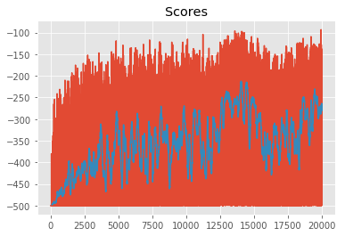
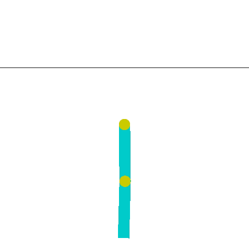
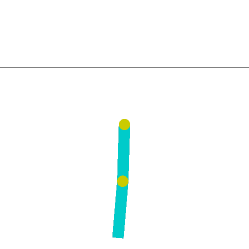

# Tile Coding

### Results
Here a quick graphical description of the results:

### Instructions

Follow the instructions in `Tile_Coding.ipynb` to learn how to discretize continuous state spaces, to use tabular solution methods to solve complex tasks. The corresponding solutions can be found in `Tile_Coding_Solution.ipynb`.
